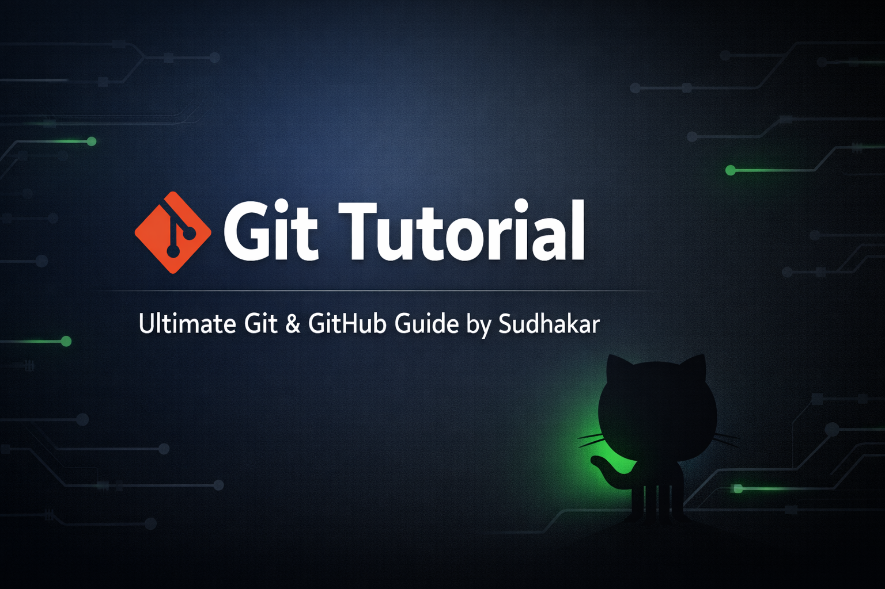

# The Ultimate Git & GitHub Tutorial

Welcome to the ultimate guide to mastering Git and GitHub! This repository is designed to be a comprehensive, production-quality learning resource for developers of all levels. Whether you're a complete beginner or looking to solidify your understanding of industry-standard workflows, this tutorial has you covered.

## 🚀 10-Minute Quick Start

New to Git? [Start here for a 10-minute introduction to the basics!](./docs/00-quick-start/00-quick-start.md)

## Why This Tutorial?

- **Beginner-Friendly:** Starts with the absolute basics and builds up complexity gradually.
- **Industry-Aligned:** Focuses on the workflows and best practices used in professional development teams.
- **Structured for Self-Learning:** Each section builds on the previous one, with clear explanations and hands-on exercises.
- **Portfolio-Ready:** By completing this tutorial, you will have a solid project to showcase your understanding of modern version control.

## Table of Contents

### Part 1: Introduction
- [01-introduction/01-what-is-version-control.md](./docs/01-introduction/01-what-is-version-control.md)
- [01-introduction/02-what-is-git.md](./docs/01-introduction/02-what-is-git.md)
- [01-introduction/03-git-vs-github.md](./docs/01-introduction/03-git-vs-github.md)

### Part 2: Getting Started
- [02-getting-started/01-installing-git.md](./docs/02-getting-started/01-installing-git.md)
- [02-getting-started/02-configuring-git.md](./docs/02-getting-started/02-configuring-git.md)
- [02-getting-started/03-your-first-repository.md](./docs/02-getting-started/03-your-first-repository.md)

### Part 3: Basic Commands
- [03-basic-commands/01-the-staging-area.md](./docs/03-basic-commands/01-the-staging-area.md)
- [03-basic-commands/02-making-commits.md](./docs/03-basic-commands/02-making-commits.md)
- [03-basic-commands/03-viewing-history.md](./docs/03-basic-commands/03-viewing-history.md)
- [03-basic-commands/04-ignoring-files.md](./docs/03-basic-commands/04-ignoring-files.md)

### Part 4: Branching and Merging
- [04-branching-and-merging/01-what-are-branches.md](./docs/04-branching-and-merging/01-what-are-branches.md)
- [04-branching-and-merging/02-merging-branches.md](./docs/04-branching-and-merging/02-merging-branches.md)
- [04-branching-and-merging/03-merge-conflicts.md](./docs/04-branching-and-merging/03-merge-conflicts.md)

### Part 5: Remote Repositories
- [05-remote-repositories/01-working-with-remotes.md](./docs/05-remote-repositories/01-working-with-remotes.md)
- [05-remote-repositories/02-fetching-and-pulling.md](./docs/05-remote-repositories/02-fetching-and-pulling.md)
- [05-remote-repositories/03-pushing-code.md](./docs/05-remote-repositories/03-pushing-code.md)
- [05-remote-repositories/04-github-pull-requests.md](./docs/05-remote-repositories/04-github-pull-requests.md)

### Part 6: Advanced Git
- [06-advanced-git/01-interactive-rebasing.md](./docs/06-advanced-git/01-interactive-rebasing.md)
- [06-advanced-git/02-merging-vs-rebasing.md](./docs/06-advanced-git/02-merging-vs-rebasing.md)
- [06-advanced-git/03-cherry-picking.md](./docs/06-advanced-git/03-cherry-picking.md)
- [06-advanced-git/04-reset-and-revert.md](./docs/06-advanced-git/04-reset-and-revert.md)

### Part 7: Workflows and Best Practices
- [07-workflows-and-best-practices/01-feature-branch-workflow.md](./docs/07-workflows-and-best-practices/01-feature-branch-workflow.md)
- [07-workflows-and-best-practices/02-gitflow-overview.md](./docs/07-workflows-and-best-practices/02-gitflow-overview.md)
- [07-workflows-and-best-practices/03-writing-good-commit-messages.md](./docs/07-workflows-and-best-practices/03-writing-good-commit-messages.md)
- [07-workflows-and-best-practices/04-keeping-a-clean-history.md](./docs/07-workflows-and-best-practices/04-keeping-a-clean-history.md)
- [07-workflows-and-best-practices/05-protected-branches.md](./docs/07-workflows-and-best-practices/05-protected-branches.md)

### Part 8: Extras
- [08-extras/01-troubleshooting-guide.md](./docs/08-extras/01-troubleshooting-guide.md)
- [08-extras/02-common-interview-questions.md](./docs/08-extras/02-common-interview-questions.md)
- [08-extras/03-git-cheat-sheet.md](./docs/08-extras/03-git-cheat-sheet.md)

### Part 9: Real-World Scenarios
- [09-real-world-scenarios/01-exercises.md](./docs/09-real-world-scenarios/01-exercises.md)

## How to Contribute

Contributions are welcome! Please see our [CONTRIBUTING.md](./CONTRIBUTING.md) for details on how to get started.
