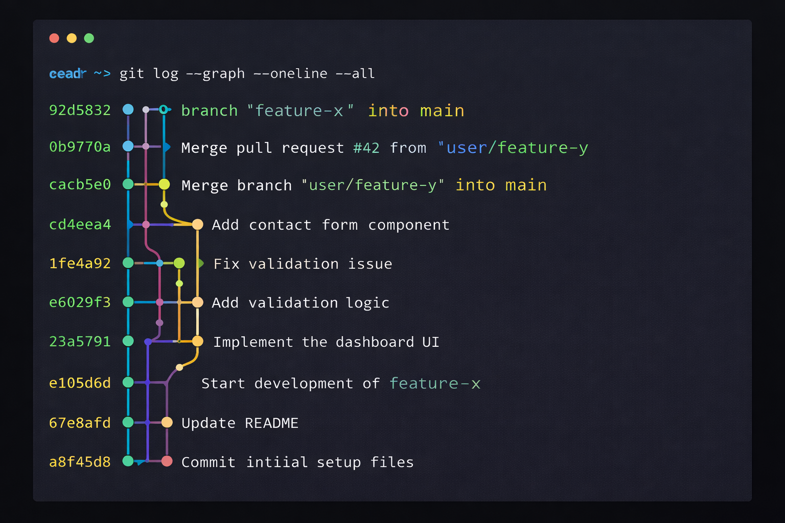

# Viewing History

To see the history of commits for a repository, you can use the `git log` command.

`git log`

This will show you a list of all the commits in reverse chronological order.

## Viewing the Differences

The `git diff` command is used to see the changes you've made to your files.

*   `git diff`: Shows the changes between your working directory and the staging area.
*   `git diff --staged`: Shows the changes between the staging area and the last commit.
*   `git diff HEAD`: Shows all the changes in your working directory since the last commit.
