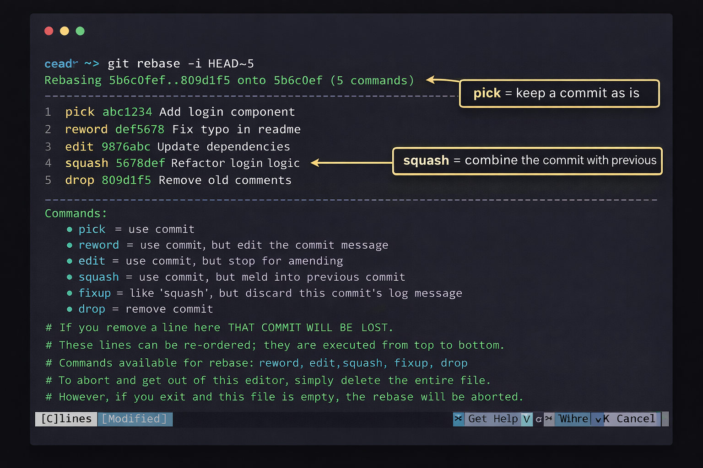

# Interactive Rebasing

Interactive rebasing is a powerful tool that allows you to rewrite your commit history. You can use it to:

*   Reorder commits
*   Combine multiple commits into one (squashing)
*   Edit commit messages
*   Remove commits

To start an interactive rebase, you use the `git rebase -i` command and specify the range of commits you want to edit. For example, to edit the last 3 commits:

`git rebase -i HEAD~3`

This will open an editor with a list of the commits. You can then choose what to do with each commit.
