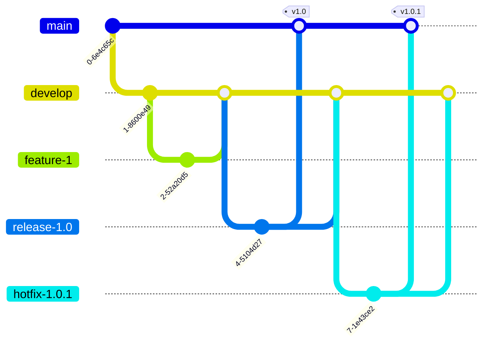

# GitFlow Overview

GitFlow is a more structured branching model than the Feature Branch Workflow. It's designed for projects with a scheduled release cycle.

## Visualizing GitFlow

Here is a diagram illustrating the GitFlow branching model:

It introduces several new types of branches:

*   **`main`:** This branch stores the official release history.
*   **`develop`:** This is the integration branch for new features.
*   **`feature-*`:** These branches are used to develop new features. They branch off of `develop` and are merged back into `develop`.
*   **`release-*`:** These branches are used to prepare for a new production release. They branch off of `develop` and are merged into both `main` and `develop`.
*   **`hotfix-*`:** These branches are used to quickly patch production releases. They branch off of `main` and are merged into both `main` and `develop`.

GitFlow is a powerful workflow, but it can be overly complex for smaller projects.
