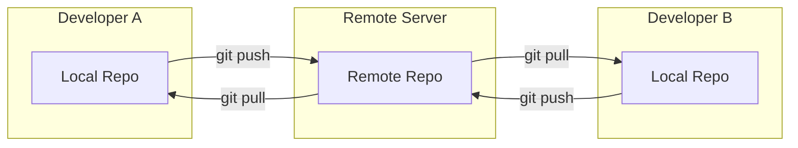
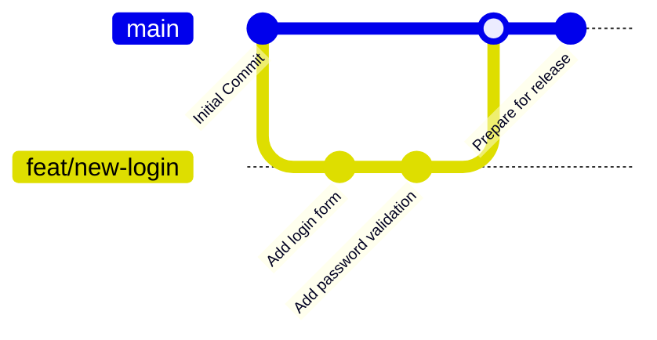
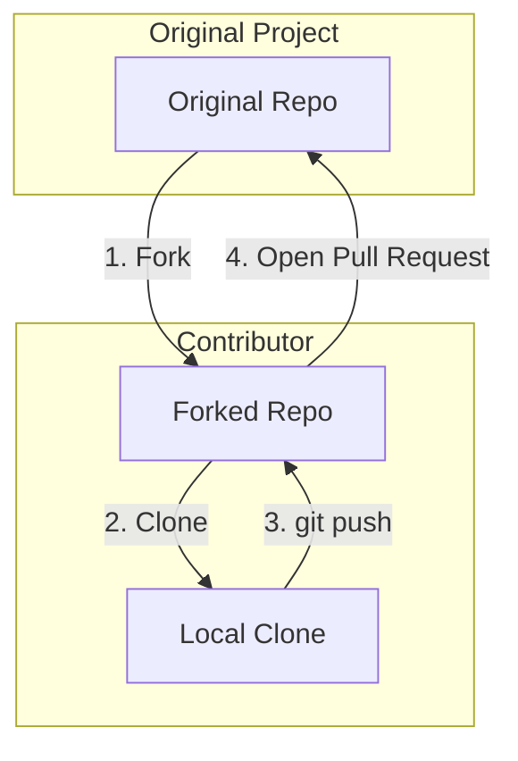
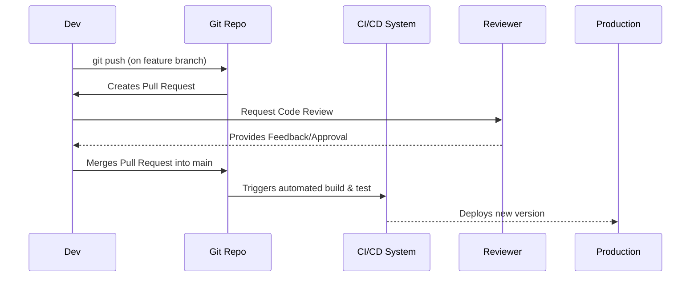
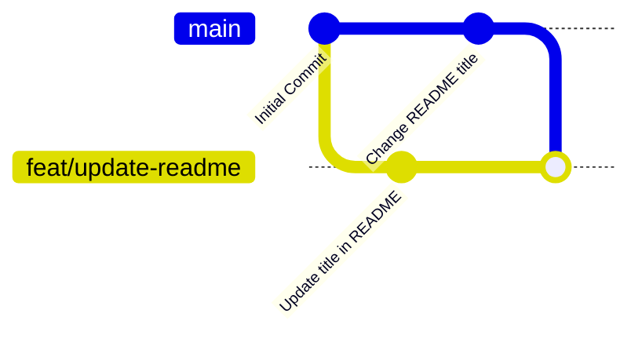

# Git Visual Workflows

Understanding Git workflows can be challenging with text alone. These diagrams illustrate the most common workflows and concepts to help you visualize how Git operates in a team environment.

---

### 1. General Git Workflow

This diagram shows the fundamental flow of work between a developer's local machine and a central remote repository.

**Explanation:** Developers work on their own **Local Repo**. When they are ready to share their changes, they `push` them to the **Remote Repo**. To get the latest changes from others, they `pull` from the **Remote Repo** into their local one.

---

### 2. Git Branch Workflow

This is the most common workflow for developing new features. Work is done on an isolated `feature` branch to keep the `main` branch stable.

**Explanation:**
1. The `main` branch contains the stable, production-ready code.
2. A new branch (`feat/new-login`) is created from `main`.
3. All new work and commits are made on the feature branch.
4. Once the feature is complete and tested, it is merged back into `main`.

---

### 3. Fork Workflow

This workflow is common in open-source projects where contributors may not have direct access to the main repository.

**Explanation:**
1. A contributor **forks** the original repository, creating a personal copy on their own account.
2. They **clone** their fork to their local machine to work on it.
3. After making changes, they **push** their commits to their forked repository.
4. Finally, they open a **Pull Request** from their fork to the original project, requesting that their changes be merged.

---

### 4. Pull Request Lifecycle

This diagram illustrates the end-to-end process of getting code from a developer's machine into the final product.

**Explanation:** The lifecycle begins when a developer pushes code and opens a Pull Request. After passing a code review and automated checks, the code is merged and automatically deployed.

---

### 5. Merge Conflict Workflow

A merge conflict occurs when Git cannot automatically resolve differences in code between two commits.

**Explanation:** In this diagram, both the `main` and `feat/update-readme` branches modified the same line in the `README` file. When trying to merge `main` into the feature branch, Git detects a **conflict** and pauses the merge, requiring the developer to resolve it manually.
